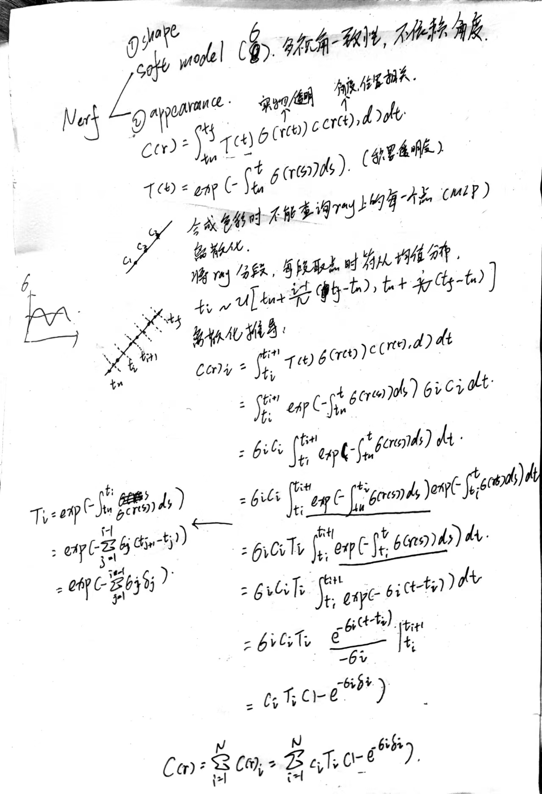
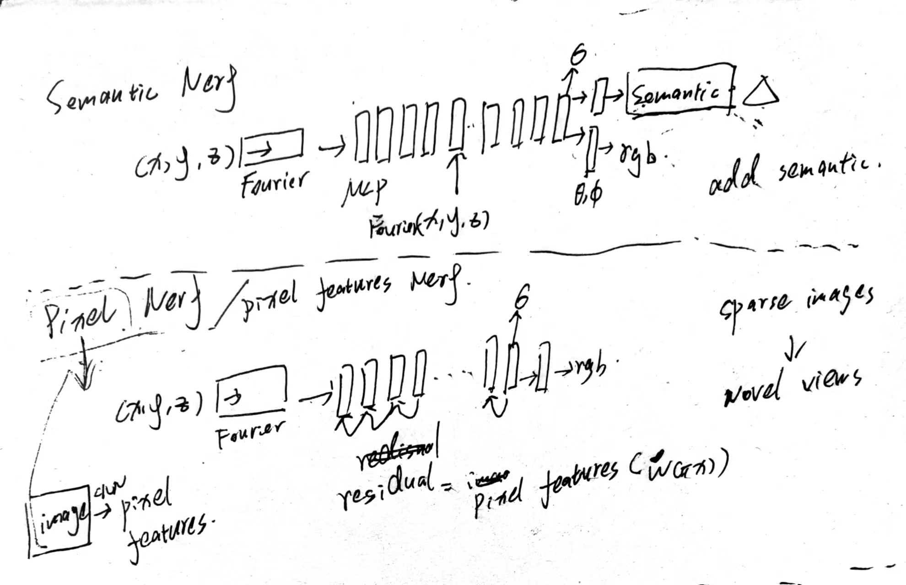

2021/9/25 交流记录

## Nerf 本身相关

#### 1.Nerf

#### 2.Semantic Nerf

#### 3.Pixel Nerf

## Nerf与Grasp相关

#### 1.目标：物体标注抓取标签，训练Nerf，类似物体one-shot生成抓取位置

#### 2.Bundle Adjust Nerf 解决 few-shot

#### 3.Pixel Nerf 提取特征 

   