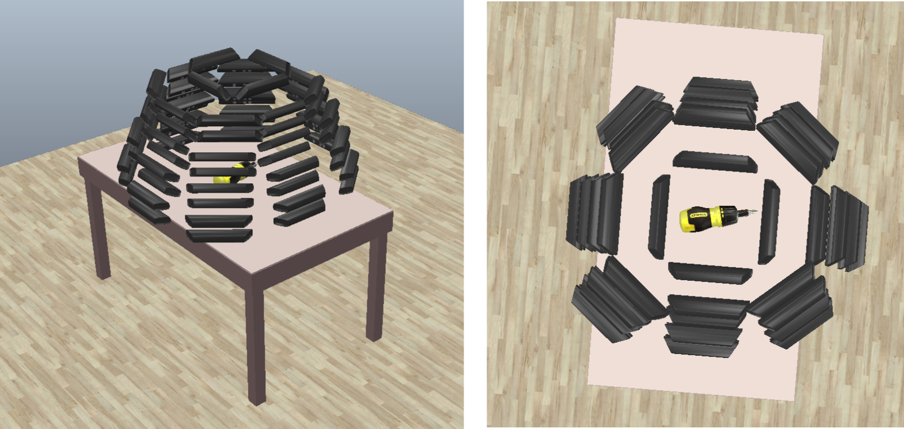
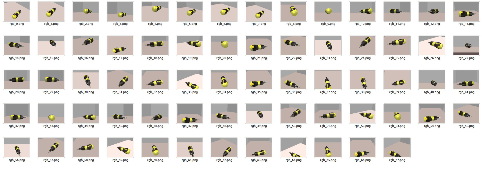
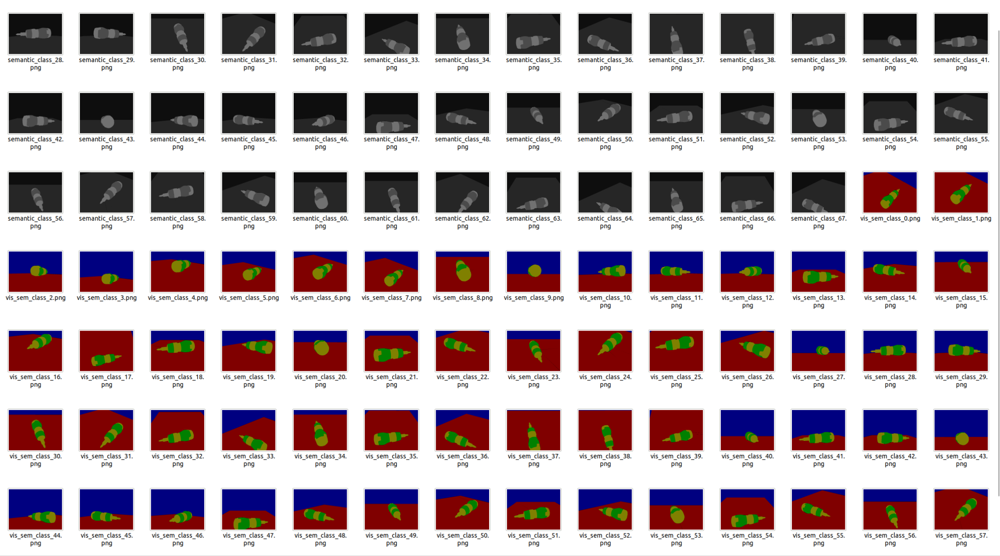
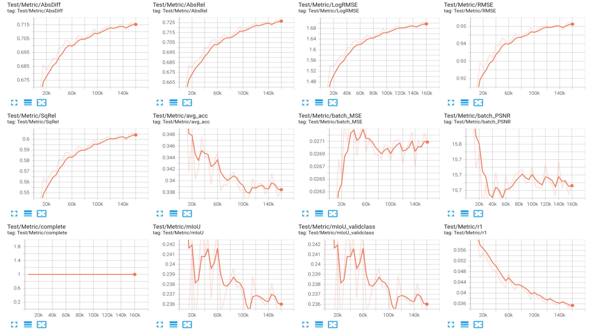
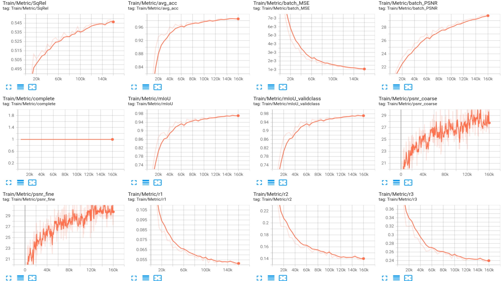
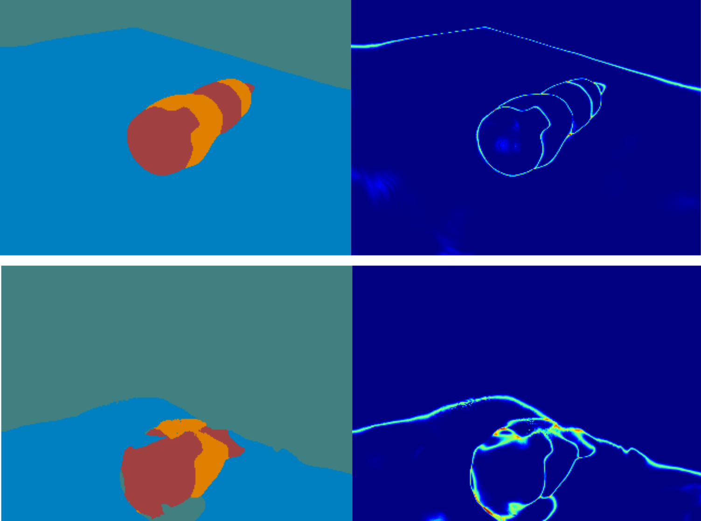

## 一、近期工作总结

### 1、在coppeliasim中自建数据集

最开始设置了68个视角（相机可隐去），好处在于易于获得彩色、深度图以及相机位姿，目标随时可替换。

### 2、对采集的数据进行标注
对背景与抓取语义进行标注，共四类：桌子、墙、螺丝刀适合抓取部分、螺丝刀其他部分

原始数据

标注结果

### 3、训练结果

test结果

train结果

训练结果出现了过拟合，在训练集上表现较好，在测试集上很差，推测是数据量不够。

## 二、下一步工作计划

### 1、增加采集数据量，验证在test render中是否能得到更好的结果，并完成label-propagation实验。

### 2、与pixel-nerf整合，利用其one-shot、few-shot特性，期望在稀疏视角输入下获得媲美稠密输入下得到的结果。

### 3、与barf整合，利用其不需要已知输入相机位姿的特性，与上述两点结合，期望实现仅需人工标注稀疏视角图像下的稀疏像素，在输入相机位姿未知的情况下获得抓取语义的拓展。