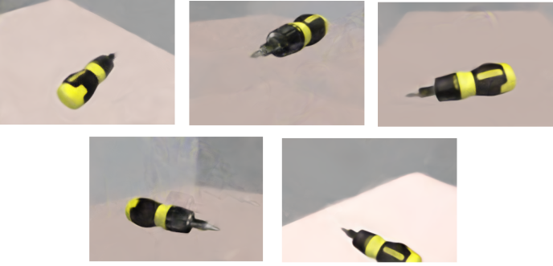
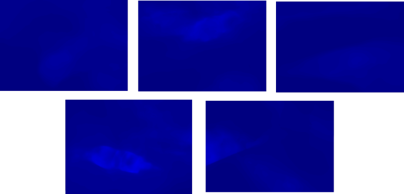
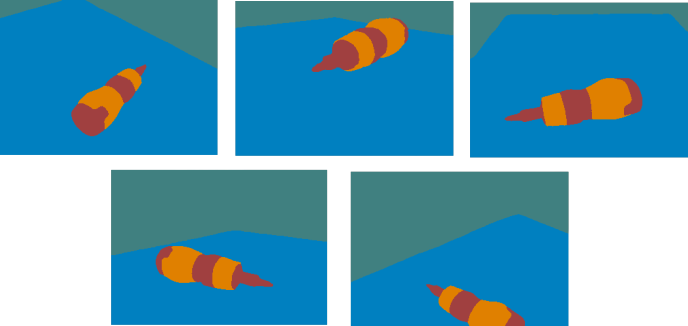
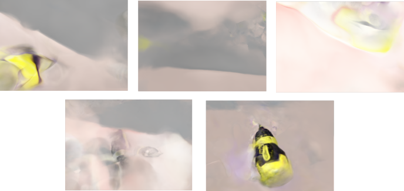
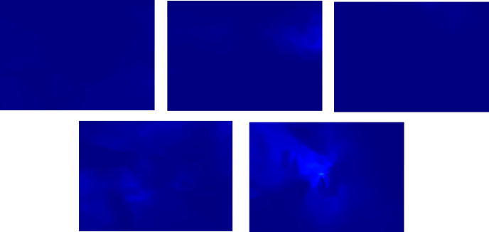
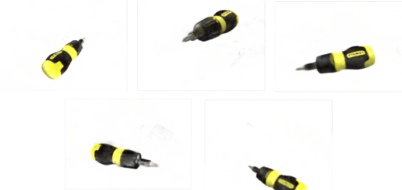
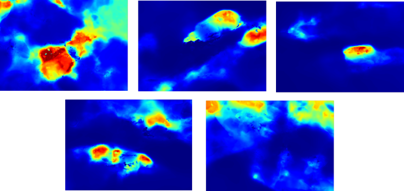
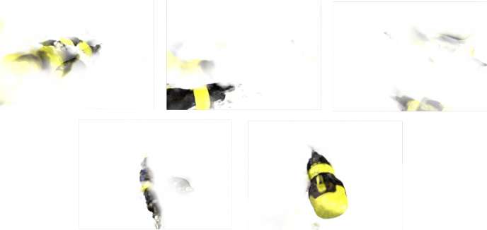
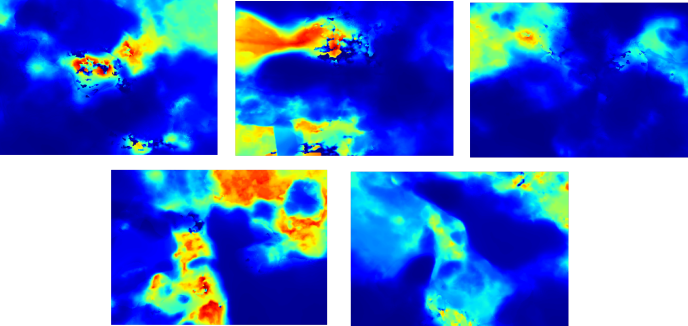
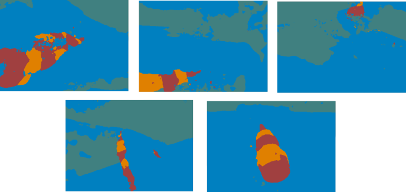

## 实验结果汇总

## 1、非白色背景下的实验结果
### Train
### (a)rgb render results

### (b)depth render results

### (c)semantic render results

### Test
### (a)rgb render results

### (b)depth render results

### (c)semantic render results

## 2、白色背景下的实验结果
### Train
### (a)rgb render results

### (b)depth render results

### (c)semantic render results

### Test
### (a)rgb render results

### (b)depth render results

### (c)semantic render results

## 问题
### 1、两者在test render 上的效果都不理想，相较于非白色背景，白色背景下的test render取得了更好的视觉效果。

### 2、对于白色背景下，semantic_map生成有一点问题，认为不能直接用rgb_map生成的思路。

### 3、后续又做了改变训练集与测试集比例的实验（34：34 to 60:8），在测试集上的表现有所增强，目前新的数据集（780张图像）已经生成，在找人标注中。